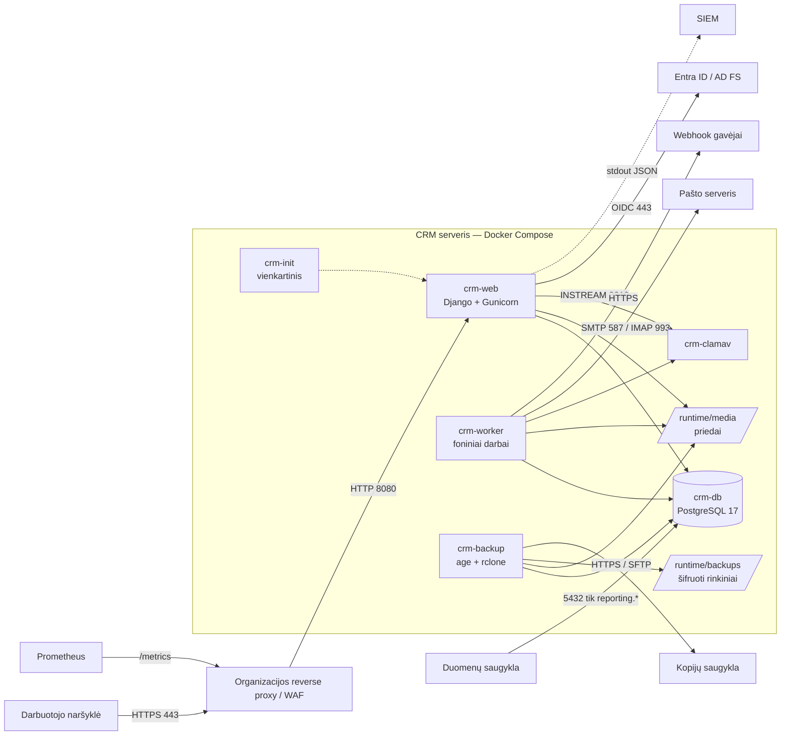
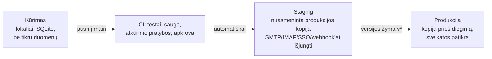
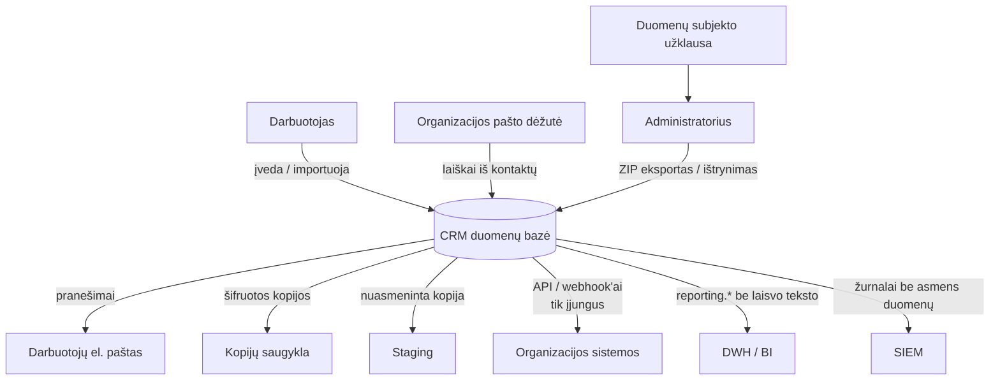

# 2. Architektūra ir schemos

Schemos pateiktos Mermaid formatu (GitHub, GitLab, Confluence ir dauguma
Markdown peržiūros priemonių jas atvaizduoja).

## 2.1 Loginė schema



## 2.2 Prisijungimas ir teisės

```mermaid
sequenceDiagram
  participant N as Naršyklė
  participant C as CRM
  participant I as Entra ID / AD FS
  N->>C: /oidc/authenticate/
  C->>N: 302 į IdP (state, nonce)
  N->>I: prisijungimas (MFA pagal organizacijos politiką)
  I->>N: 302 atgal su code
  N->>C: /oidc/callback/?code
  C->>I: code → ID žetonas (server-to-server)
  C->>C: parašas, nonce, iss, aud, exp, tid; tapatybė pagal oid
  C->>C: AD grupės → rolė ir komandos; be CRM grupės — atmetama
  C->>N: sesija
  loop kas 15 min (nustatoma)
    C->>I: tylus pertikrinimas (prompt=none)
    I-->>C: išjungtas naudotojas → atjungiama; pakitusios grupės → pritaikoma
  end
```

## 2.3 Aplinkos



## 2.4 Asmens duomenų srautai



## 2.5 Komponentai ir duomenų vietos

| Komponentas | Paskirtis | Duomenys | Tinklas |
|---|---|---|---|
| `crm-web` | Sąsaja, API, prisijungimas | nesaugo (be `/tmp`) | įeina 8080 iš proxy |
| `crm-worker` | Pranešimai, IMAP, webhook'ai, automatika, saugojimo terminai, neaktyvių paskyrų išjungimas | nesaugo | išeina SMTP, IMAP, HTTPS |
| `crm-db` | PostgreSQL | visi įrašai, auditas | tik Docker tinkle (arba 5432 DWH) |
| `runtime/media` | Priedų failai | failai | — |
| `crm-backup` | Šifruotos kopijos | `runtime/backups` | išeina į kopijų saugyklą |
| `crm-clamav` | Antivirusas | parašai `runtime/clamav` | išeina parašų atnaujinimui |
| `crm-init` | `runtime/media` teisės prieš paleidimą | — | — |

Kubernetes variantas: web Deployment (2+ replikos), migracijų Job, 8 CronJob'ai
vietoj `crm-worker`, išorinis PostgreSQL ir S3 saugykla — `docs/KUBERNETES.md`.
